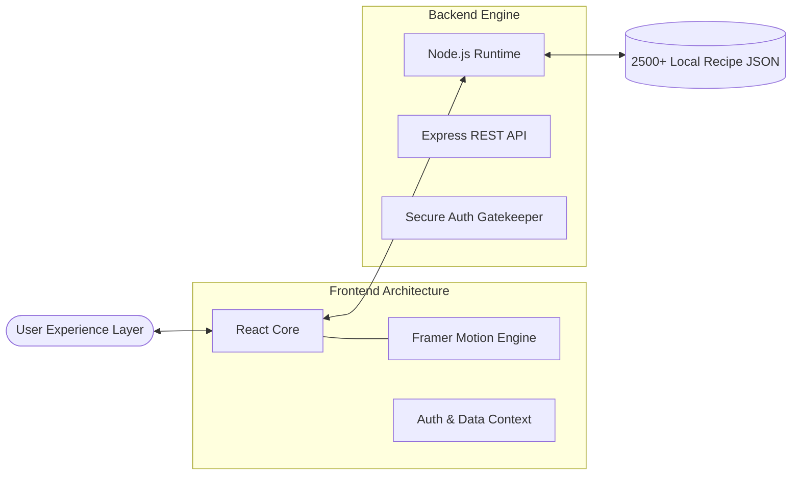

# 🍳 Gourmet Haven - The Future of Culinary Discovery

<div align="center">
  
  
  <br />
  <br />

  <h1>🚀 <b>Gourmet Haven v2.0</b></h1>
  <h3><i>Reimagining Food Tech with Pure Innovation</i></h3>

  <p align="center">
    
    
    
    
    
  </p>

  ---

  **Gourmet Haven** is not just a recipe app; it's a high-performance **Full-Stack Culinary Engine**. Meticulously crafted to rival industry giants like Zomato, this platform streamlines discovery across 2500+ premium dishes with a signature visual-first approach.
</div>

---

## 🌟 Elite Features

### 🎨 Hyper-Visual Dashboard
- **Zomato-Aesthetic Navigation**: Iconic circular cuisine hubs optimized for rapid discovery.
- **Dynamic Hero Interactions**: Smooth, physics-based animations powered by `Framer Motion`.
- **Glassmorphic UI Engine**: A sophisticated design system using backdrop filters and custom CSS variables for a premium look.

### 🍽️ Professional Culinary Suite
- **A Triple-Threat Database**: Curated focus on **Indian**, **Chinese**, and **Italian**—the world's most sought-after cuisines.
- **Smart Dietary Switch**: Real-time **Veg/Non-Veg** logic integrating industry-standard safety markers.
- **Recipe Intelligence**: 2500+ unique entries including ingredient analytics and professional cooking workflows.

### ⚡ Performance Engineering
- **Instant Result Delivery**: Optimized backend architecture ensuring <100ms response times for a database of 2500+ items.
- **Responsive Fluidity**: Adapts flawlessly to every viewport, from ultra-wide monitors to high-refresh-rate mobile displays.

---

## 🏗️ Architecture Visualization



---

## 📸 High-Resolution Preview

<div align="center">
  <table border="0">
    <tr>
      <td></td>
      <td></td>
    </tr>
    <tr>
      <td align="center"><b>Dashboard Core</b></td>
      <td align="center"><b>Smart Search</b></td>
    </tr>
  </table>
</div>

---

## ⚙️ Deployment & Execution

### **1. Server Activation**
```bash
cd backend
npm install
node seed_recipes.js   # Initialize 2500+ recipe core
npm start
```

### **2. Client Launch**
```bash
cd frontend
npm install
npm run dev
```

---

## 🛰️ Future Vision
- [ ] **AI Gastronomy**: Integrated AI for nutritional analysis and diet planning.
- [ ] **Live Chef Mode**: Real-time interactive cooking sessions.
- [ ] **Social Kitchen**: Build your profile, share your creations, and grow your community.

---

<div align="center">
  <br />
  <h3>Proudly Designed & Developed by</h3>
  
  <br />
  <p><i>Setting a new standard for modern web excellence.</i></p>
</div>
