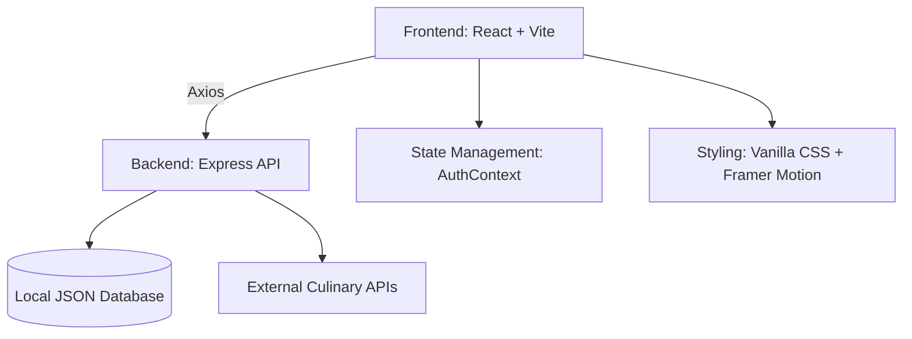

# 🍳 Gourmet Haven - The Ultimate Food Discovery Platform

<div align="center">
  
  
  <br />

  <h1>✨ A Premium Culinary Journey ✨</h1>

  <p align="center">
    
    
    
    
  </p>

  **Gourmet Haven** is a state-of-the-art recipe discovery engine inspired by modern food delivery aesthetics like Zomato and Swiggy. It features a massive database of 2500+ authentic Indian, Chinese, and Italian dishes with a premium user experience.
</div>

---

## 🚀 Key Features

### 💎 Ultra-Premium UI/UX
- **Zomato-Inspired Dashboard**: Circular cuisine navigators and immersive handpicked collections.
- **Glassmorphic Navigation**: A sleek, translucent header that tracks your scroll.
- **Micro-Animations**: Powered by `Framer Motion` for smooth transitions and interactive feedback.

### 🍱 Extensive Culinary Database
- **2500+ Handcrafted Dishes**: A specialized local database focusing on **Indian**, **Chinese**, and **Italian** cuisines.
- **Smart Diet Logic**: Instant **Veg/Non-Veg** toggling with professional industry-standard indicators.
- **Chef-Level Details**: Each recipe includes precise ingredients, step-by-step instructions, and YouTube tutorials.

### ⚡ Cutting-Edge Performance
- **Instant Search**: Optimized backend fetching that delivers 2500+ results in milliseconds.
- **Responsive Design**: Flawless experience across Mobile, Tablet, and Desktop.

---

## 🛠️ Tech Stack & Architecture



- **Frontend**: React 18, Vite, Framer Motion, Lucide Icons.
- **Backend**: Node.js, Express, JWT Authentication, Bcrypt.
- **Assets**: High-resolution Unsplash imagery for realistic dish representation.

---

## 📸 Sneak Peek

| Dashboard Experience | Recipe Analytics | Search Intelligence |
| :--- | :--- | :--- |
|  |  |  |

---

## ⚙️ Installation & Setup

### 1. Backend Setup
```bash
cd backend
npm install
node seed_recipes.js  # Generate the 2500 recipe database
npm start
```

### 2. Frontend Setup
```bash
cd frontend
npm install
npm run dev
```

---

## 🔮 Future Roadmap
- [ ] AI-Powered Ingredient Recognition from Photos.
- [ ] Real-time "Cooking Mode" with Voice Control.
- [ ] Social Features: Follow your favorite Home Chefs.
- [ ] Personalized Meal Planning based on Macros.

---

<div align="center">
  <p>Created with ❤️ for food lovers everywhere.</p>
  
</div>
